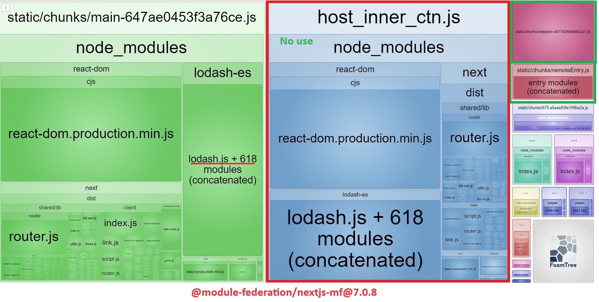
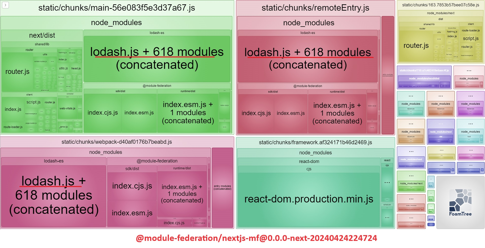
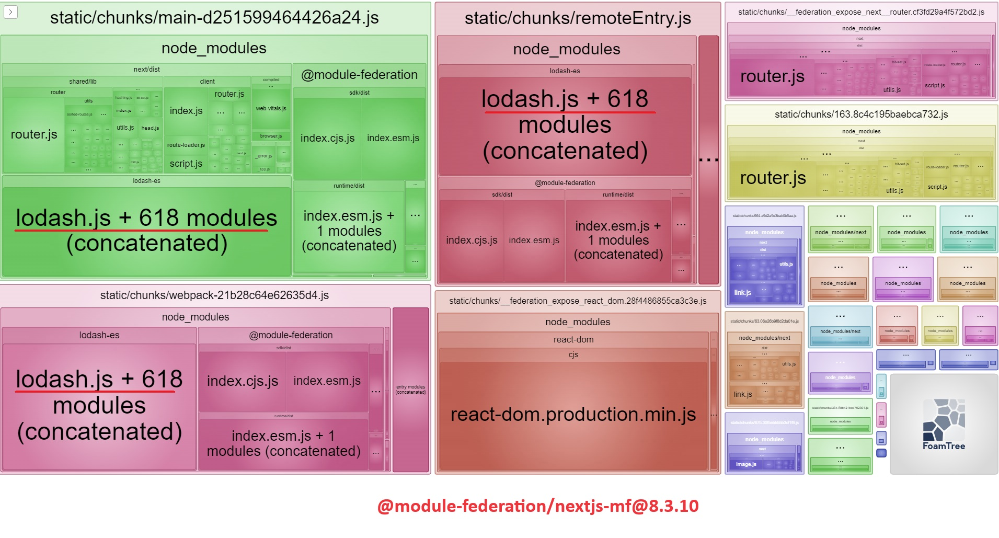

## Description

This repo reproduces the issue of `@module-federation/nextjs-mf@8.3.10`. The shared modules (in this case: `lodash-es`) are added multiple time into bundle. It cause redundant code and increase the time to load page. The issue does not happen with `@module-federation/nextjs-mf@7.0.8`

## Steps

- Install packages

    ```bash
    yarn
    ```
- Build: 
  ```bash
  yarn build
  ```
- Check the bundle size on the browser
  
## Expected
> The shared modules should only be included into the bundle only one time

## Actual
> The shared modules are added into both **main**, **webpack** and **remoteEntry**


## Evidences

  